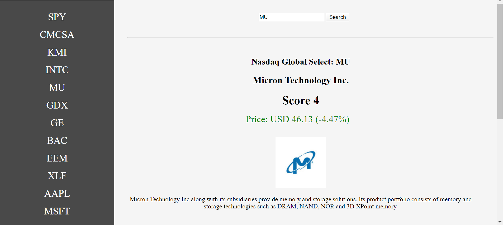

# StockPrice-App
This is a small application that prompts you to "Enter Stock Symbol". 
The app retrieves and displays the stock price and some company info for that stock.  
This includes short company description, stock score, and the logo of the company. 
API used  
https://financialmodelingprep.com/?ref=apilist.fun 
Examples of Stock Symbols are displayed on the html page, they are retrieved from this API end point https://financialmodelingprep.com/api/v3/company/stock/list . 
The Web app is split into HTML, CSS and JavaScript +jQuery 
 
https://tatianaazulay.github.io/StockPrice-App/ 
 

