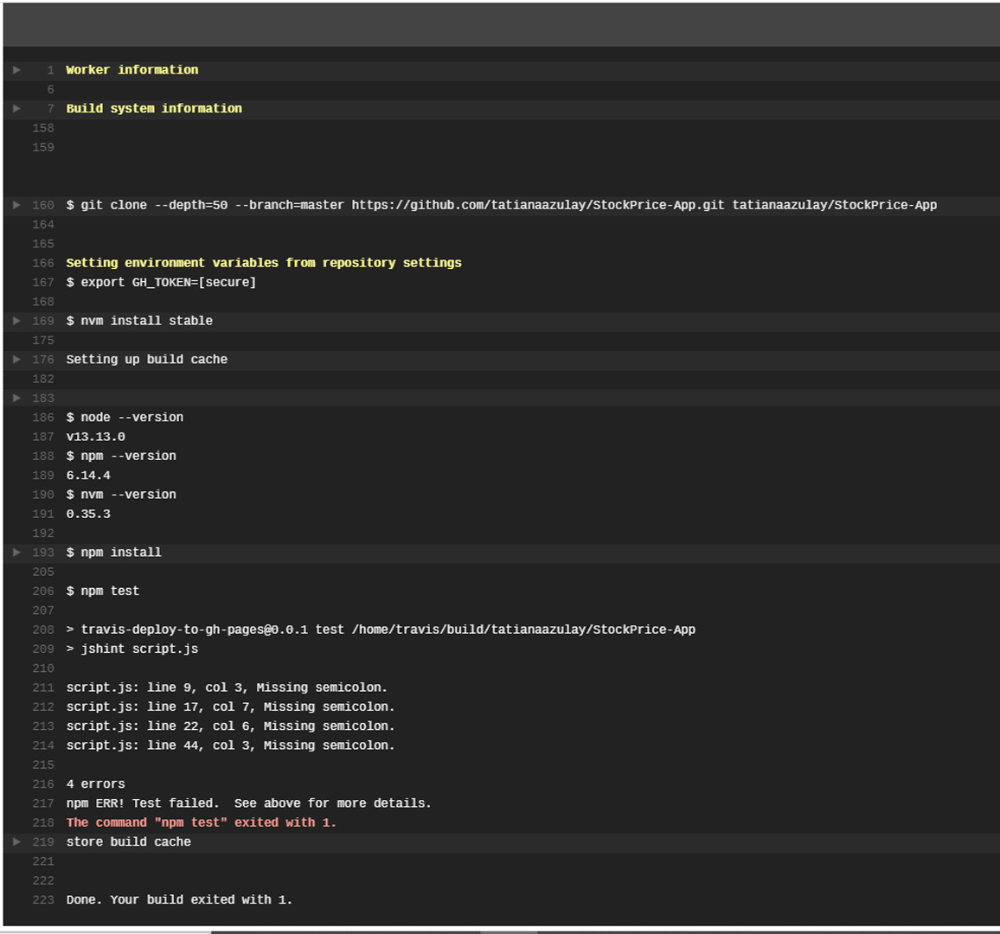
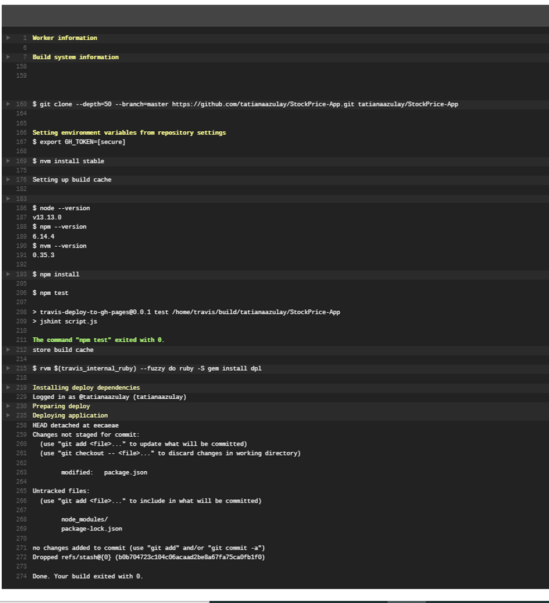

# StockPrice-App-Auto-deploying-to-gh-pages-with-Travis-CI
This is a small application that prompts you to "Enter Stock Symbol". 
The app retrieves and displays the stock price and some company info for that stock.  
This includes short company description, stock score, and the logo of the company. 
API used  
https://financialmodelingprep.com/developer/docs/ 
Examples of Stock Symbols are displayed on the html page, they are retrieved from this API end point https://financialmodelingprep.com/api/v3/company/stock/list . 
The Web app is split into HTML, CSS and JavaScript +jQuery 
 
<strong>Continuous integration with Travis CI</strong> 
Travis automatically scans the repo and looks for the .travis.yml file which informs travis this is a node.js app. 
Minimal configuration of .travis.yml for StockPrice-App: 
 
Travis also looks for a package.json file, downloads all the modules listed in devDependencies and runs specified scripts. 
The package.json tells Travis to run jshint on our script.js file. 
jshint is a tool to analyze js code quality. 
This is an example of Travis CI log after the test has failed (js code errors were inserted intentionally): 
 
This is an example of Travis CI log after the test and build have completed successfully: 
 
Travis CI automatically deploys the app to gh-pages only after the test and build have completed successfully. 
<bold>Deployed@:</bold> 
https://tatianaazulay.github.io/StockPrice-App/ 
 

